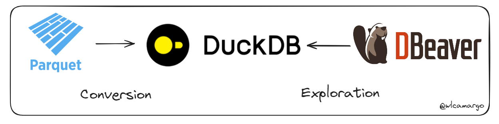
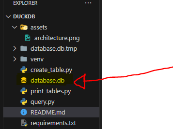
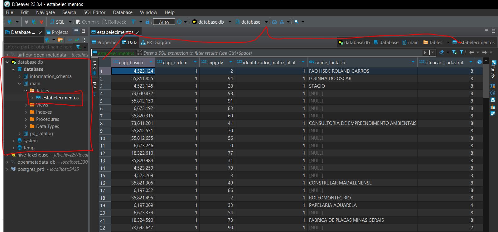

# Duckdb Sample

## About

Este repo consiste em mostrar como converter um arquivo parquet em uma tabela de Duckdb e depois realizar a exploração através do Dbeaver. 

## Sample database

## Sample exploration

## Developer
[Wallace Camargo](https://www.linkedin.com/in/wallace-camargo-35b615171/) 

## References
https://duckdb.org/docs/

